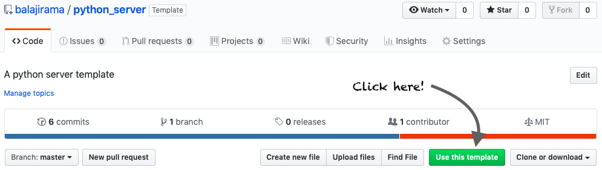

# python_server
 A python server template

# Steps
* Use the template repository to create your new repo on GitHub directly
   * Click the "Use this template" icon
   
   * Give you repo a name and description
   
   * GitHub generates the new repo for you
* Once your new repo has been generated, you can clone that repo to your computer
* Depending on which database you want to use(sqlite3 or MySQL), start the appropriate server
   * Your page will be up and running at `localhost:5000`
* Start by editing the `index.html` file to edit the content of the main page
   * Use bootstrap code to make the content look nice
   * The master.html already uses the latest bootstrap components
   * Adding additional routes and more code
